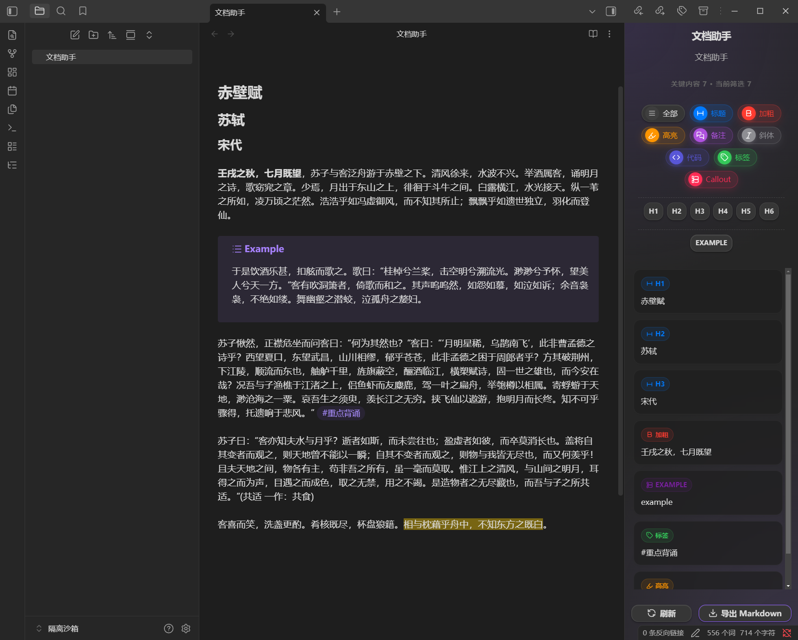

# Obsidian File Assistant | 文档助手

[English](#english) | [中文](#中文)

---

## English Description

**Obsidian File Assistant** is a powerful sidebar plugin designed to help you navigate and manage your document content more efficiently. It automatically extracts key elements from your active note and presents them in a clean, interactive side panel.

### ✨ Key Features
- **Smart Filtering**: Quickly filter content by Headings (H1-H6), Bold text, Highlights, Callouts, Tags, Code blocks, and more.
- **Visual Navigation**: Clicking on an item in the sidebar helps you quickly locate it in your document.
- **Export Power**: Export your filtered results directly to a new Markdown file with one click.
- **Interactive UI**: A modern, responsive design that stays in sync with your editing.

### 🖼️ Preview

### 🚀 Installation
1. Download `main.js`, `manifest.json`, and `styles.css` from the latest release.
2. Create a folder `obsidian-file-assistant` in your vault's `.obsidian/plugins/` directory.
3. Move the three files into that folder.
4. Enable the plugin in **Settings > Community Plugins**.

---

## 中文介绍

**文档助手 (Obsidian File Assistant)** 是一款强大的Obsidian侧边栏插件，旨在帮助您更高效地浏览和管理文档内容。它能自动提取当前笔记中的关键元素，并在简洁的交互式面板中分类展示。

### ✨ 核心功能
- **智能过滤**：支持按标题 (H1-H6)、加粗、高亮、引用 (Callout)、标签、代码块等多种维度快速筛选内容。
- **可视化导航**：在侧边栏点击相应条目，即可快速定位到文档中的对应位置。
- **一键导出**：支持将过滤后的结果直接导出为新的 Markdown 文件。
- **现代界面**：响应式设计，提供流畅的交互体验，并与您的编辑状态实时同步。

### 🖼️ 预览

### 🚀 安装方法
1. 从 Release 页面下载 `main.js`, `manifest.json`, 和 `styles.css`。
2. 在您的库目录 `.obsidian/plugins/` 下创建一个名为 `obsidian-file-assistant` 的文件夹。
3. 将下载的三个文件放入该文件夹。
4. 在 **设置 > 第三方插件** 中启用插件。

---

## Development | 开发
1. `npm install`
2. `npm run dev` for development or `npm run build` for production.
